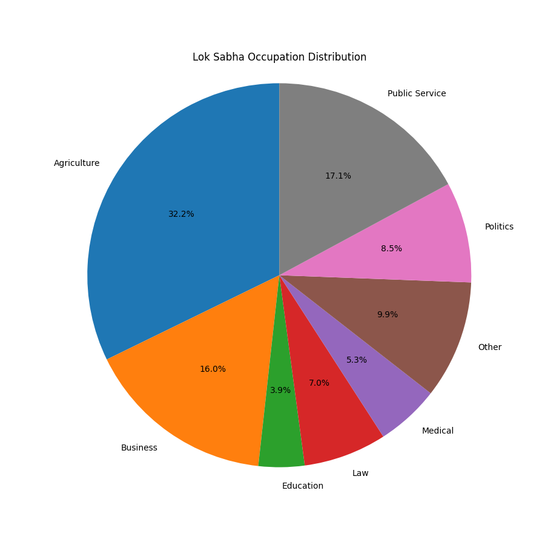

# 2024 India election research project

This repository contains compiled datasets, reports, and summaries relating to the **2024 Indian General Elections**, focusing on Lok Sabha member data. The data is sourced primarily from the **Association for Democratic Reforms (ADR)** and manually curated datasets for analysis purposes. The data has a focus on occupational analyses, and as a result, has codings for different occupation types. However, this repo serves as an ongoing and expanded data source for personal and asset data for members of the Lok Sabha

## 📚 Repository Overview

The repository is divided into the following sections:

- **ADR Reports**: Original publications from ADR containing visual summaries and insights.
- **Datasets**: Cleaned and raw data files in spreadsheet format, ready for analysis.
- **Other Research Components**: Memos, summaries, and metadata useful for further contextual research.

---

## 🧾 ADR Reports

These are official PDF reports published by ADR analyzing candidate data.

### 1. [ADR crime and asset analysis.pdf](./ADR%20crime%20and%20asset%20analysis.pdf)  
Summary report published by ADR analyzing the criminal background and financial assets of Lok Sabha candidates in 2024. Includes charts and key statistics.

### 2. [Relected asset criminal.pdf](./Relected%20asset%20criminal.pdf)  
Analysis of **re-elected candidates'** asset values and declared criminal cases. Focuses on incumbency advantages.

### 3. [Winning candidate analyses.pdf](./Winning%20candidate%20analyses.pdf)  
Overview of 2024 winners, such as education, gender, criminal record, and asset levels.

---

## 📊 Datasets

These Excel files contain structured data for analysis and modeling.

### 4. [All Candidate Asset details.xlsx](./All%20Candidate%20Asset%20details.xlsx)  
Raw data listing asset declarations for all Lok Sabha candidates. Filterable by party, state, and value tiers.

### 5. [Master Lok Sabha.xlsx](./Master%20Lok%20Sabha.xlsx)  
Primary merged dataset that integrates asset, criminal, and election result data. Cleaned and analysis-ready.

### 6. [final lok sabha.xlsx](./final%20lok%20sabha.xlsx)  
Final version of the dataset prepared for immediate analysis. Columns are cleaned and simplified.

### 7. [Lok sabha data source.xlsx](./Lok%20sabha%20data%20source.xlsx)  
Original raw data used to construct the master dataset. Contains early-stage scraped entries.

---

## 🧾 Other Research Components

These documents include memos and repository metadata.

### 8. [Memo Democratic Dynasties.docx](./Memo%20Democratic%20Dynasties.docx)  
A short memo analyzing dynastic politics, highlighting familial political patterns in major parties.

### 9. [README.md](./README.md)  
You're reading it! This file explains the contents and structure of the repository.

---

## 📈 Visualizations

  
*Figure: Pie chart showing declared occupations of 2024 Lok Sabha candidates.*

---

## 📚 Bibliographies and Citations

These documents provide source references, citation formats, and scholarly summaries relevant to the dataset and election research.

### 10. [2024_Election_Scholar_Results.docx](./2024_Election_Scholar_Results.docx)  
Nicely formatted citation, link, and title of academic papers

### 11. [2024_Election_Bibliography.docx](./2024_Election_Bibliography.docx)  
Bibliography of academic papers related to the 2024 election.

### 12. [citations_chicago.json](./citations_chicago.json)  
Machine-readable JSON file formatted in Chicago citation style. Useful for auto-generating reference sections.

---

## 📌 Notes

- All data is for **academic and non-commercial** purposes.
- Source attribution: [ADR India](https://adrindia.org)
- Dataful: 

---

## 🛠️ Contributing

Pull requests are welcome. For major changes, please open an issue first to discuss what you would like to change.

---

## 📄 License

MIT License — see `LICENSE.md` (to be added).
